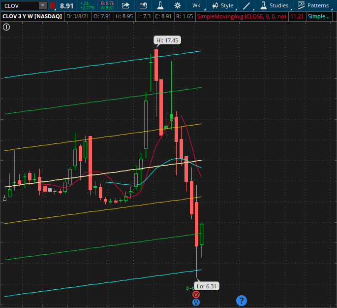

## ThinkOrSwim Scripts

Repo containing collection of ThinkOrSwim scripts

* **red_to_green_ratio.txt**  
This script will help quickly evaluate the ratio of red candles to green candles for a given length.  The idea here is
when the ratio of red to green candles turn to 3:2 (i.e., amount of red candles significantly outnumbers green candles), this indicates the bears are winning. In this case, the trader may want to tighten the trailing stop or exit the position if price action moves under the prior day's low.

* **close_to_sma_distance.txt**  
A simple script to use for custom columns. This will calculate the distance between the closing price of the candle bar to a 20 SMA line.  The distance can be used as a way to gauge how strong the bearish/bullish momentum is.

* **custom_scanners.txt** - Custom scanners I have built:  
  **Standard Deviation Dip Scanner**:  This scanner will search tickers that have dipped at least 1 deviation level below the median on a weekly chart.  Great for investors who are interested in dip buying!  

  
  
